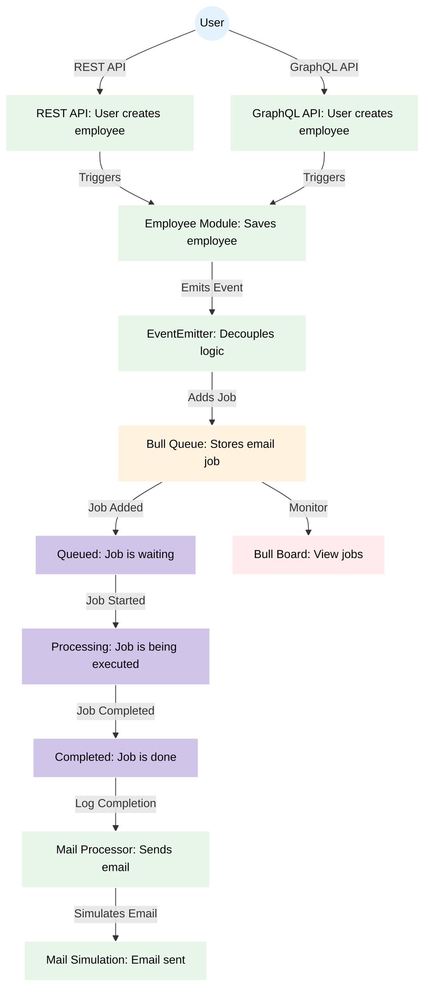

```mermaid
graph TD
    %% Top Layer - User Interaction
    User((User)) -->|REST API| REST[REST API: User creates employee]
    User -->|GraphQL API| GraphQL[GraphQL API: User creates employee]
    
    %% Middle Layer - Backend Processing
    REST -->|Triggers| EmployeeModule[Employee Module: Saves employee]
    GraphQL -->|Triggers| EmployeeModule
    EmployeeModule -->|Emits Event| EventEmitter[EventEmitter: Decouples logic]
    EventEmitter -->|Adds Job| BullQueue[Bull Queue: Stores email job]
    
    %% Queue Layer - Job States
    BullQueue -->|Job Added| Queued[Queued: Job is waiting]
    Queued -->|Job Started| Processing[Processing: Job is being executed]
    Processing -->|Job Completed| Completed[Completed: Job is done]
    
    %% Lower Layer - Queue Processing
    Completed -->|Log Completion| MailProcessor[Mail Processor: Sends email]
    MailProcessor -->|Simulates Email| MailSimulation[Mail Simulation: Email sent]
    
    %% Monitoring Layer
    BullQueue -->|Monitor| BullBoard[Bull Board: View jobs]
    
    %% Custom Styles
    classDef userLayer fill:#E3F2FD,stroke:#FFFFFF,stroke-width:1px,color:#000;
    classDef backendLayer fill:#E8F5E9,stroke:#FFFFFF,stroke-width:1px,color:#000;
    classDef queueLayer fill:#FFF3E0,stroke:#FFFFFF,stroke-width:1px,color:#000;
    classDef monitoringLayer fill:#FFEBEE,stroke:#FFFFFF,stroke-width:1px,color:#000;
    classDef jobState fill:#D1C4E9,stroke:#FFFFFF,stroke-width:1px,color:#000;

    class User userLayer;
    class REST,GraphQL,EmployeeModule,EventEmitter backendLayer;
    class BullQueue,Queued,Processing,Completed queueLayer;
    class MailProcessor,MailSimulation backendLayer;
    class BullBoard monitoringLayer;
    class Queued,Processing,Completed jobState;


```